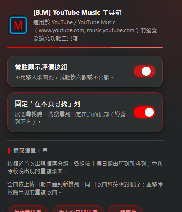

# [B.M] YouTube Music 工具箱

[](https://developer.chrome.com/docs/extensions/mv3/)
[](https://music.youtube.com)
[](https://github.com/BoringMan314/bm-youtube-music-tool)
[](https://github.com/BoringMan314/bm-youtube-music-tool/releases)
[](LICENSE)

適用於 [YouTube Music](https://music.youtube.com)（`music.youtube.com`）的瀏覽器擴充功能工具箱：常駐顯示喜歡／不喜歡按鈕，並提供播放清單排序、複製與一鍵喜歡。部分清單工具亦支援 `www.youtube.com`。

*适用于 YouTube Music（`music.youtube.com`）的浏览器扩展工具箱。*<br>
*YouTube Music（`music.youtube.com`）向けのブラウザー拡張機能ツールボックス。*<br>
*A browser extension toolbox for YouTube Music (`music.youtube.com`).*

> **聲明**：本專案為第三方輔助工具，與 YouTube／Google 官方無關。使用請遵守該站服務條款與著作權規範。排序等功能使用網站內部 API，可能隨網站改版失效。

---



---

## 目錄

- [功能](#功能)
- [系統需求](#系統需求)
- [安裝方式](#安裝方式)
- [本機開發與測試](#本機開發與測試)
- [技術概要](#技術概要)
- [專案結構](#專案結構)
- [版本與多語系](#版本與多語系)
- [隱私說明](#隱私說明)
- [維護者：更新 GitHub 與 Chrome 線上應用程式商店](#維護者更新-github-與-chrome-線上應用程式商店)
- [授權](#授權)
- [問題與建議](#問題與建議)

---

## 功能

### 評價按鈕常駐（僅 YouTube Music）

- 讓原有的「喜歡／不喜歡」按鈕常駐顯示，保留原生圖示、色彩與評價操作。
- 於工具列彈出面板可開關常駐顯示。

### 固定「在本頁尋找」列（僅 YouTube Music）

- 播放清單展開「在本頁尋找」時，將搜尋列固定在導覽列下方，捲動結果時仍可輸入。
- 於工具列彈出面板可開關。

### 播放清單工具

支援 `music.youtube.com` 與 `www.youtube.com` 的一般播放清單（需可確認的編輯權限）：

- **依作者排序**：按上傳頻道首次出現順序分組，頻道內依上傳日期由舊到新；並移除較晚出現的重複歌曲。
- **依上傳日期排序**：全曲依上傳日期由舊到新；同日保留相對順序；並移除較晚出現的重複歌曲。兩種模式共用掃描快取。
- **複製該清單**：建立私人副本，保留順序與重複項目。
- **一鍵喜歡**（僅 Music）：將明確為尚未評價（`INDIFFERENT`）的歌曲設為喜歡；已喜歡／不喜歡／狀態不明者略過。
- **匯出掃描快取**：手動另存 JSON。

關閉工具列彈出面板不會中斷網頁面板；重新整理或關閉分頁會停止，下次可接續。缺上傳日期時停止，絕不拿發行日期代替。

專責 YouTube（不含評價常駐／一鍵喜歡）的姊妹專案見 [bm-youtube-tool](https://github.com/BoringMan314/bm-youtube-tool)。

---

## 系統需求

- **Chrome** 或 **Microsoft Edge**（Chromium）等支援 **Manifest V3** 的瀏覽器。
- 排序／複製／一鍵喜歡須已登入，並開啟對應網站的播放清單頁。

---

## 安裝方式

### 從原始碼載入（開發人員模式）

1. 點選本頁綠色 **Code** → **Download ZIP** 解壓，或執行 `git clone https://github.com/BoringMan314/bm-youtube-music-tool.git` 複製本倉庫。
2. 以 **Chrome** 或 **Microsoft Edge** 開啟 `chrome://extensions`（在 Edge 為 `edge://extensions`）。
3. 開啟「**開發人員模式**」→「**載入未封裝項目**」→ 選取含 [`manifest.json`](manifest.json) 的**專案根目錄**（勿選子資料夾）。
4. 重新整理已開啟的 YouTube Music 分頁後使用。

發行 ZIP 解壓後，同樣選取含 `manifest.json` 的資料夾即可。

---

## 本機開發與測試

```powershell
node verification/sorter-check.cjs
node verification/check.cjs
node verification/popup-check.cjs
```

修改 CSS 或腳本後，請先在 `chrome://extensions` **重新載入**本擴充，再重新整理網站分頁；已開啟分頁不會自動換用新版 CSS。

---

## 技術概要

- **內容腳本**：於 `https://music.youtube.com/*` 注入 [`content.css`](content.css) 與 [`src/feature-rating-buttons.js`](src/feature-rating-buttons.js)，解除評價按鈕區收合並同步常駐設定。
- **彈出面板**：啟動排序／喜歡／複製，並以 `activeTab` + `scripting` 注入頁面腳本。
- **頁面脈絡** [`src/injected-playlist-sorter.js`](src/injected-playlist-sorter.js)：同站 Innertube 請求；進度經 storage bridge 存於 `chrome.storage.local`。

---

## 專案結構

| 路徑 | 說明 |
|------|------|
| [`manifest.json`](manifest.json) | Manifest V3、內容腳本比對網址 |
| [`popup.html`](popup.html)／[`popup.js`](popup.js)／[`popup.css`](popup.css) | 工具列彈出面板 |
| [`content.css`](content.css) | 評價按鈕常駐樣式 |
| [`src/feature-*.js`](src/) | 功能入口與設定同步 |
| [`src/injected-*.js`](src/) | 注入網頁的處理面板 |
| [`_locales/`](_locales/) | 多語系字串 |
| [`icons/`](icons/) | 工具列與商店用圖示 |
| [`screenshot/`](screenshot/) | 說明／商店用截圖 |
| [`verification/`](verification/) | 驗證腳本 |
| [`privacy-policy.html`](privacy-policy.html) | 隱私權政策 |

---

## 版本與多語系

- **版本**：以 [`manifest.json`](manifest.json) 的 `version` 為準。
- **預設語系**：`zh_TW`（`default_locale`）。
- **內建語系**：`zh_TW`、`zh_CN`、`ja`、`en_US`。網站按鈕沿用 YouTube Music 本身語言。

---

## 隱私說明

本擴充**不蒐集、不上傳**可識別個人之帳戶或瀏覽內容至開發者伺服器；排序／評價請求僅在您操作時以目前分頁登入狀態對 YouTube／YouTube Music 同站發出。詳見 [`privacy-policy.html`](privacy-policy.html)。

**上架提醒**：若上架 Chrome Web Store，須在開發人員後台完成隱私實踐聲明，並提供隱私權政策的公開 HTTPS 網址。
---

## 維護者：更新 GitHub 與 Chrome 線上應用程式商店

### 更新至 GitHub

**Bash / Git Bash / PowerShell：**

```powershell
git add .
git commit -m "docs: 更新內容說明與商店連結"
git push origin main
```

### 更新至 Chrome 線上應用程式商店

請透過 [Chrome Web Store 開發人員控制台](https://chrome.google.com/webstore/devconsole) 手動上傳更新：

1. **遞增版本**：修改 `manifest.json` 中的 `version`。
2. **封裝套件**：將專案執行所需檔案壓縮為 ZIP 檔。
   - **必要檔案**：`manifest.json`、`popup.*`、`content.css`、`src/`、`icons/`、`_locales/`、`privacy-policy.html`
   - **建議不打包**：`.git/`、`README.md`、`verification/`、`參考/`、`screenshot/`、`*.psd`、`*.zip`、`*.url`
3. **上傳審核**：在控制台選擇項目 →「套件」→「上傳新套件」。
4. **提交送審**：確認版號、文案、截圖及隱私欄位後，提交送審。

---

## 授權

本專案以 [MIT License](LICENSE) 授權。

---

## 問題與建議

歡迎透過 [GitHub Issues](https://github.com/BoringMan314/bm-youtube-music-tool/issues) 回報錯誤或提出改善建議。回報時請一併提供瀏覽器版本、介面語言、重現步驟，以及面板上的錯誤訊息或診斷檔。
